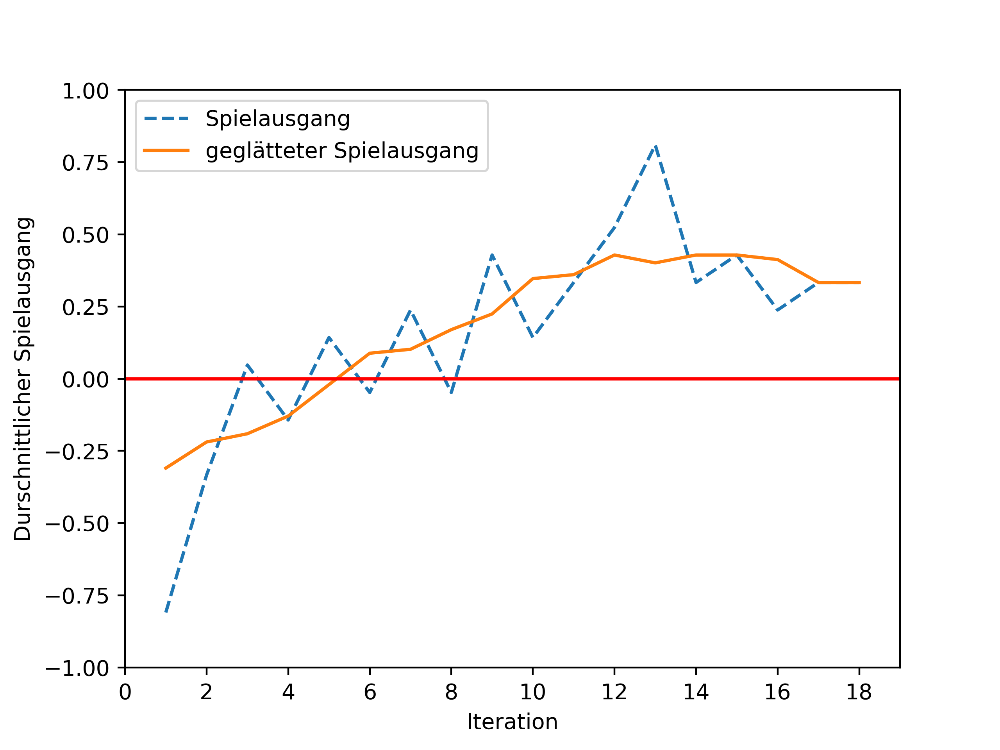
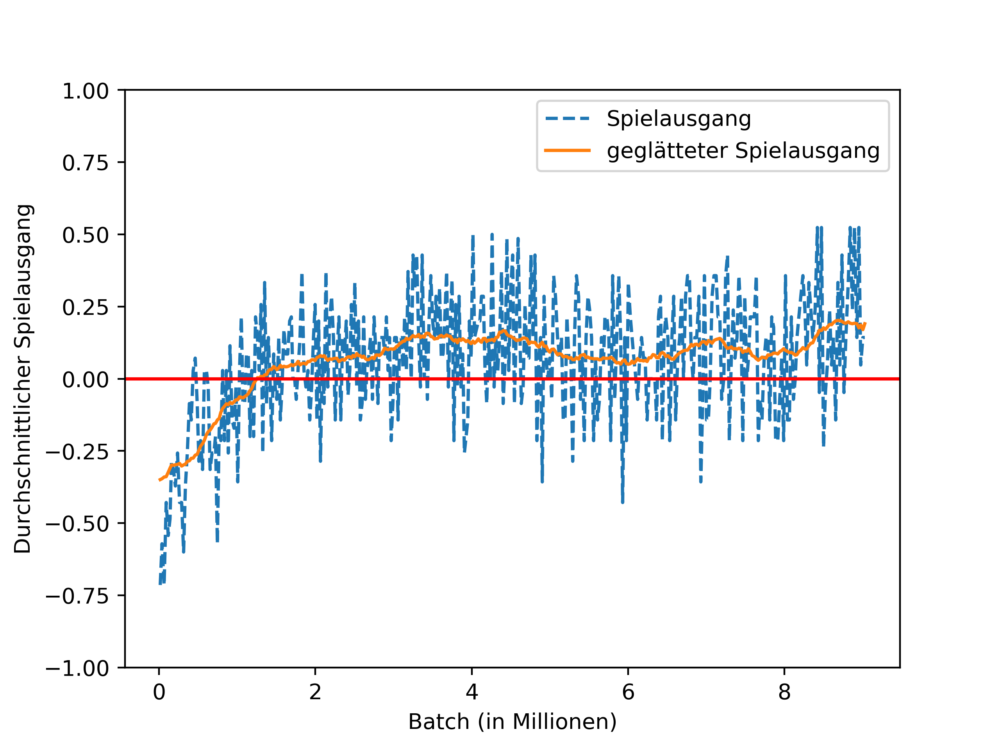
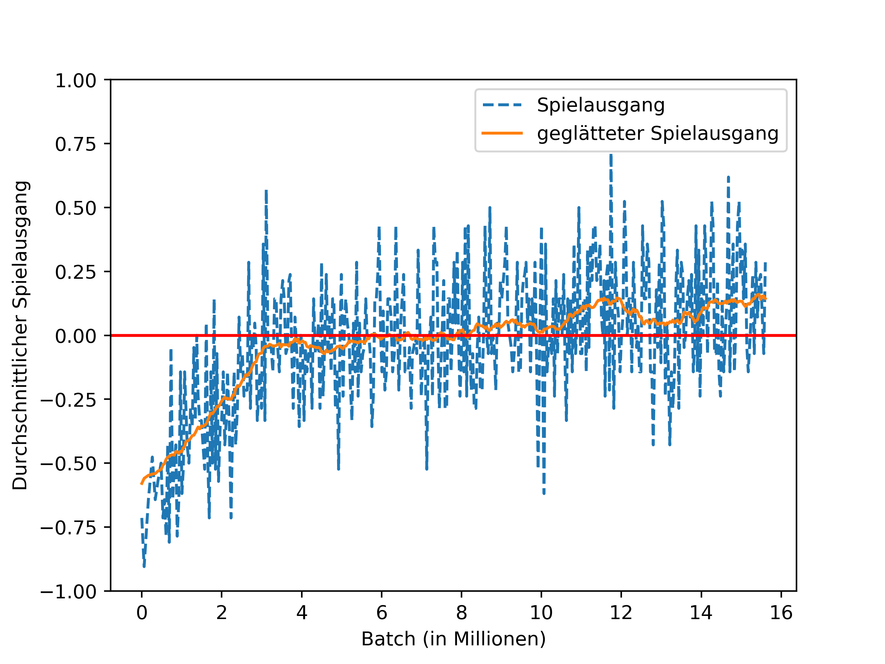

# Pure Reinforcement Training

This module uses the `hometrainer` and `reversi` modules and combines them to train
an ai agent for parts of ReversiXT using the AlphaZero algorithm.

This module contains the 'glue' and helper scripts needed to run the actual training.
The `command_line_interface.py` provides some convenience functions for the training.
It allows to easily configure the training master, playing salve and an ai client for ReversiXT.

All experiments are placed in subfolders. The experiments where run in the following order:
- [simple_8_by_8](#simple_8_by_8)
- [distributed_8_by_8](#distributed_8_by_8)
- [multiple_maps](#multiple_maps)
- [normalize_probs](#normalize_probs)
- [batch_norm](#batch_norm)

The experiments folders contain all configs for individual tests.
The main files to look out for are `training_master.py` with general settings on the test,
`neural_network.py` with the neural network structure and `input_output_conversion.py`
with details on the boards encoding in the test.

# Tests

Here is a short summary of the tests that where run.

## simple_8_by_8

This test was the first successful run that actually lead to playing strength from the trained ai.
This can be seen as a 'baseline' for further experiments. It was run sequentially without the distributed architecture.

## distributed_8_by_8

The next step was to run the same as the first test but with the distributed architecture.
In this the 8x8 board is embedded into an 12x12 input to the network.

## multiple_maps

This test uses 5 different maps to see if general strategies can be learned.
It embeds maps from 8x8 up to 10x10 into an 12x12 input.

## more_maps

This test uses more Filters, to see if this helps to improve playing strength.
It uses 3 more maps then the last run, so 8 maps in total.

# normalize_probs

In this test some changes are made to the output conversion. The output of the network is filtered so
that only valid moves get part's of the move probability distribution.
Also the extra rule of inversion stones is added. In total this test uses 13 maps.

# batch_norm

This test goes back to only the 5 maps of the 'multiple_maps' test.
It makes big changes to the neural network. It now uses batch norm + elu activation.
This test is still running, so there are no results to show here.
The test will also record test vs training error, to allow further insights into the training process.
