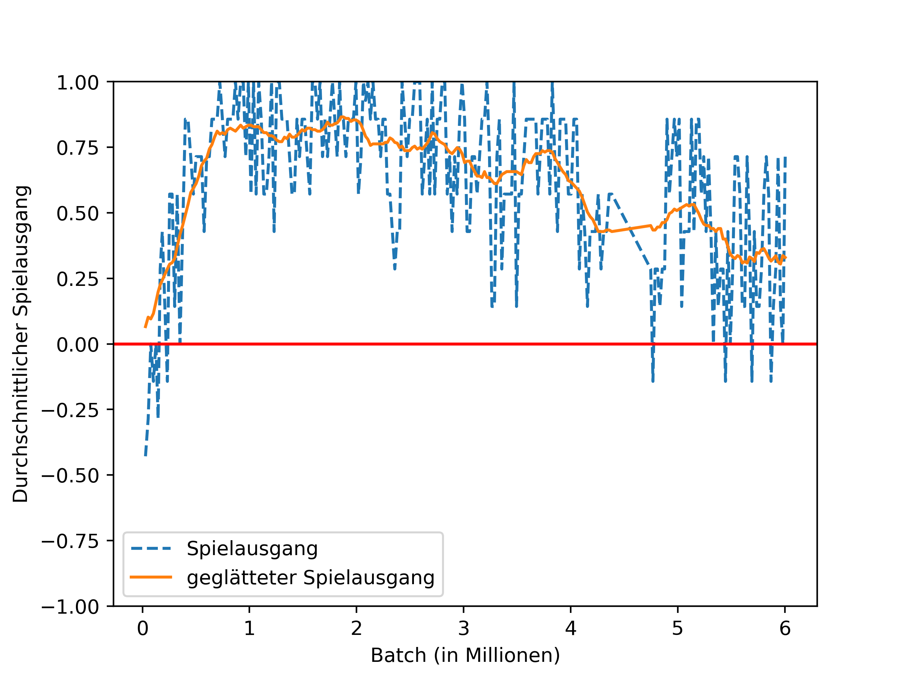
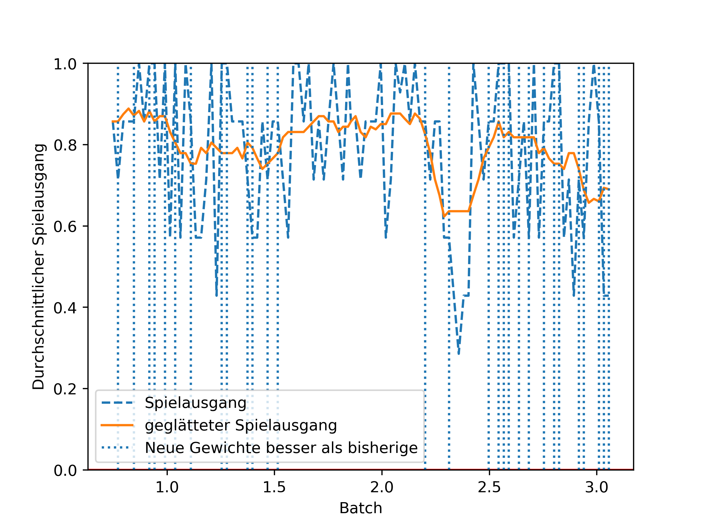

# Distributed 8 by 8

This test is run using the distributed architecture. It embeds a simple 8x8 board into
an 12x12 input for the neural network (with random positions).

## Hardware

Training Master: Quad-Core i5 PC (4 Threads), GTX 760 Graphics
Playing Slave: Quad-Core i7 Laptop (8 Threads), no Graphics

## Runtime

The test ran (in multiple smaller parts) a total of about 50 hours.

## Results

The test quickly showed winrates of about 95%, dominating the trivial AI besides som unlucky games.
After some time on this, very successfull checkpoint, the winrate dropped over the rest of the testrun,
maybe indicating overfitting to a dominant, not well generalizing playstyle.

After closer inspection, it looks like the assumption on overfitting an not well generalizing playstyse
is actually the cause for the declining playstrength. The image shows the winrate before the decline begins.
The vertical lines mark each iteration that found new, better weighs. Before the decline begins there
is no new, better strategy for qite some time. This indicates that the strategy was good, and needen a very
specialized strategy to be beaten. This new specialized strategy could then not win against an general,
external agent.

