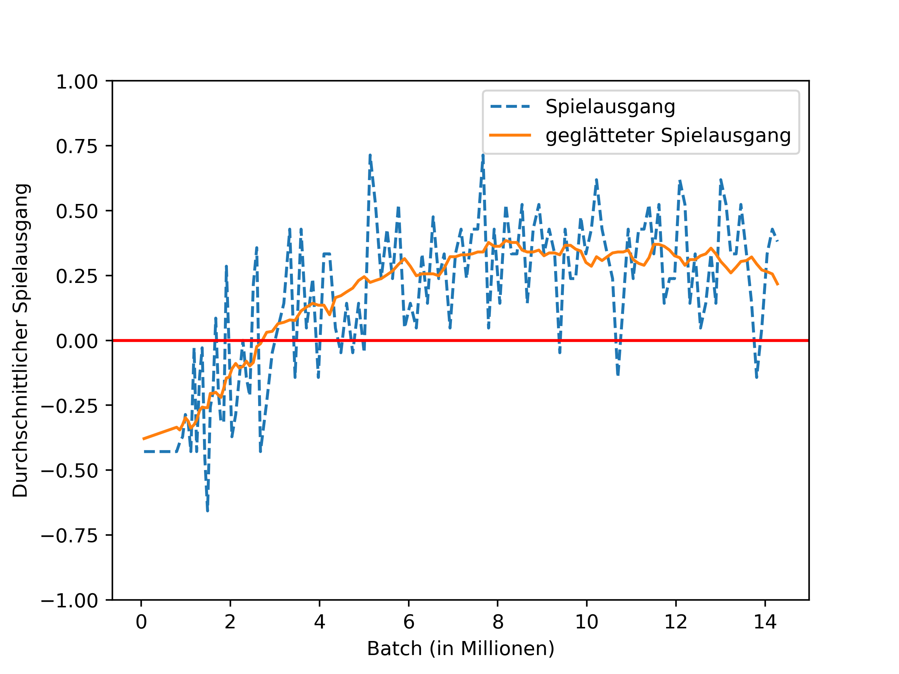

# Multiple Maps

Next experiment after 'distributed_8_by_8' that ran with a single map.
The following changes where applied.

- Use multiple maps
    We will play on a total of 5 different maps. This will show how the AI performs on learning more general
    rules than that corners are good on the simple 8 by 8 map.
    It might also help with over-fitting to one specific tactic, which seemed to be the problem in the simple 8
    by 8 example (see graphs with marked regions).
- Increase L2 Loss a little
    This is also to prevent overfitting, as the L2 loss 'spiked' when the results of the last run got
    worse again (see marked regions in the graphs). (This is a minor change, and did not influence the
    training a lot)
- Add 'deep network' skip connections with raw input to every residual block
    This could help to reduce some wasted convolutional blocks for 'passthrough' of simple information,
    like the legal moves. (This seemed to make no difference at all. It should not have any negative impact,
    so it's not mentioned further)
- Add two more residual blocks
    Maybe the worse results/tactic came because the nn could not sufficiently learn general game rules.
    Also the board got bigger in the 10 by 10 map.

## Testrun

The run took about 100 hours using three older PC's to play the games and one
modern PC with a 1080 TI for training.

## Results

The winrate went up to about 65% and stayed there for the rest of the time.
It seems that the more complex task could not be solved by the network, as it did simply
stop to progress. The fact that the win rate did not significantly drop after its maximum
value shows that the variety of maps might have lowered the chance of overfitting to one strategy.

